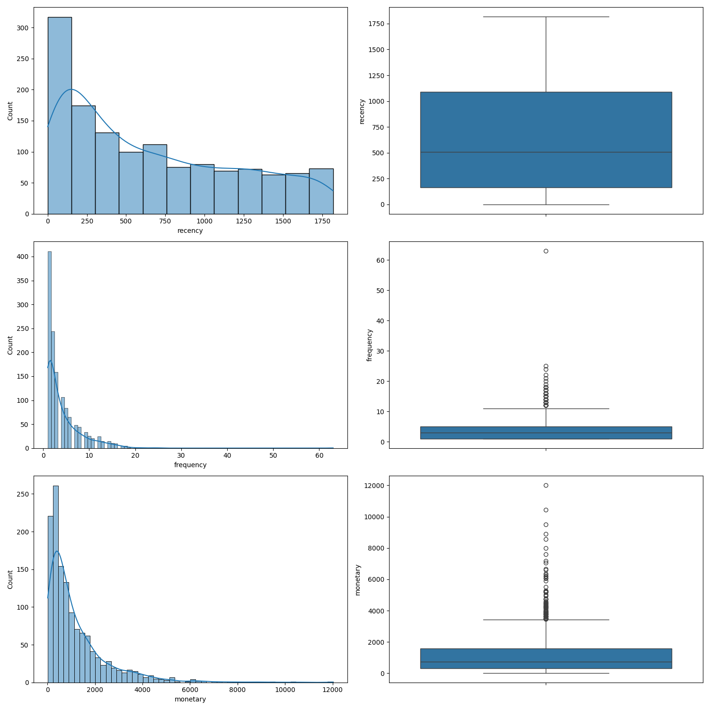
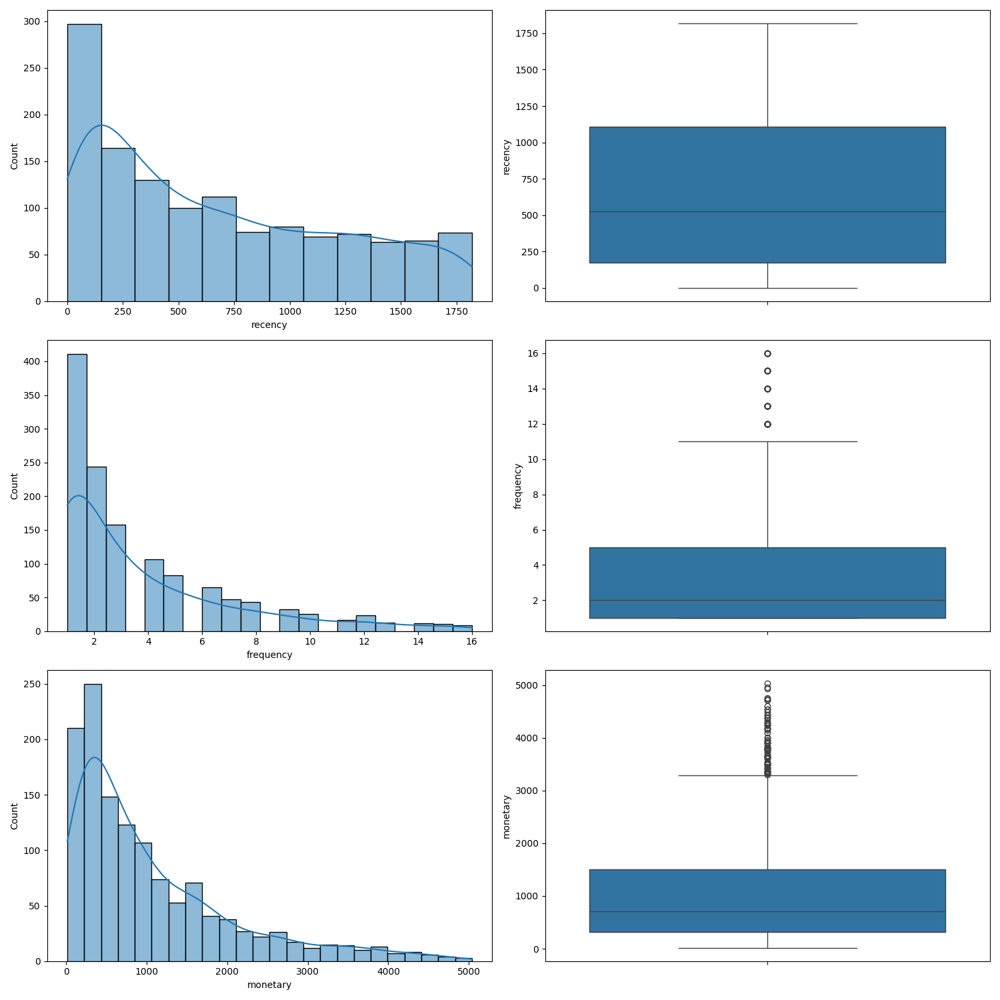

# MLTRL Card - RFM-Analysis - level 2

| Summary info        | Content, links       |
| -------------------------- | ------------- |
| Tech name               | RFM-Analysis - Car Repair Shop   |
| Current Level           | 2 [(See level 1)](./mltrl_card_level_1.md) |
| Owner(s)                | Christian Wissor                        |
| Reviewer(s)             | Christian Wissor                           |
| Main project page       | *none*   |
| Req's, V&V docs         | Master-Thesis   |
| Code repo & docs        | [Github Repository](https://github.com/SmithyW/master-thesis-mlops-study-imlpementation)   |
| Ethics checks?          | *none* |
| Coupled components      | *none*         |

**TL;DR** — The RFM-Analysis is clustering project for segmenting customer of a small car repair shop. 

### Top-level requirements

*the underlying master-thesis serves as the full requirements documentation and is not publicly available*

1. The model be capable of segmenting customers in a comporehensible way.
2. Integration into third-party systems for inference should be made possible via a suitable interface.

### Model info

The model is a K-Nearest Neighbor supervised ML estimator. For the input labels a K-Means clustering algorithm is used initially.

Implementation notes:

- Implementation leverages the python library scikit-learn. 

### Intended use

- The model will assign the a segment to a customer based on features for a conventional RFM-Analysis.
- The allocation is intended to be accomplished with exported model performing inference in a separate application.
- The RFM features will be used as input data, so the creation of that features has to be accomplished beforehand.

### Testing status

*no tests are specified or planned for now*

**Extra notes**: The model can be seen as uncritical when considering safety aspects and the entrpreneurial risk.

### Data considerations

A production invoice dataset is available for experimenting and model training.

Raw data conversion to parquet as intermediate file.
The data requires extensive preprocessing due to typos and missing validation in the source system.

The vehicles of one customer have to be merged by fuzzy matching the name and applying a hash value to the first match.

Computed values: Monetary values are highly right-skewed, Recency lightly right-skewed and Frequency is in a narrow range of values with missing values.

Few extreme outliers are present in the input data.

The data allows for scaling using sklearns StandardScaler.

#### Initial data distribution

#### Distribution after removal of ouliers

### Caveats, known edge cases, recommendations

- Specifying the amount of segments is still needed beforehand.
- Applying of privacy to the customer data requires fuzzy matching of customer names, which is not ideal and costly in terms of computational ressources.
- Recommended to update the data source to deliver unique customer IDs for all corresponding vehicles.

### MLTRL stage debrief

<!-- Succinct summary of stage progress – please respond to each question, link to extended material if needed... -->

1. What was accomplished, and by who?

The processing of the input data was altered so that a parquet file is generated and added to the MLflow artifacts. Logic for removing outliers is implemented without changing the overall distribution of the data.
More data logging steps have been added to the MLflow experiment tracking.
More input data is now tracked with DVC, updating the model version to v1.1.

2. What was punted and/or de-scoped?

    The pure clustering solution was aborted in favor of a combination with a supervised algorithm (K-Nearest Neighbors). The workflow has been updated accordingly.

3. What was learned?

    - Training a supervised learning algorithm out of the clusters generated with K-Means is giving good results for the available data.
    - Removing the outliers with prior transformation to normal distribution and applying IQR Outlier detection gave the best results and can be considered the candidate for future application development.

4. What tech debt was gained? Mitigated?

    - Changing the model was time consuming.
    - Removed old and unnessecary code blocks from the experimentation notebooks as preparation for application development.

---
