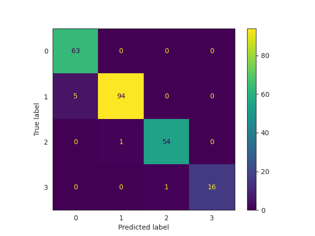
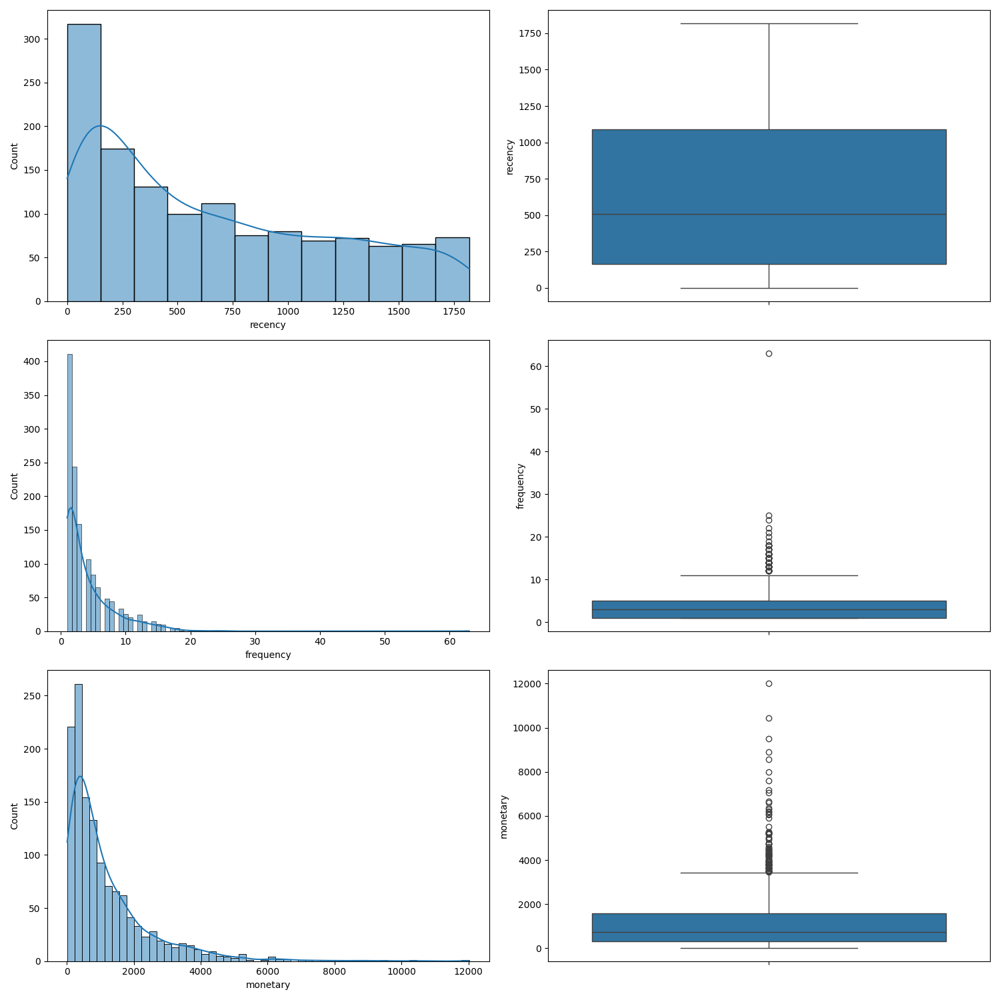
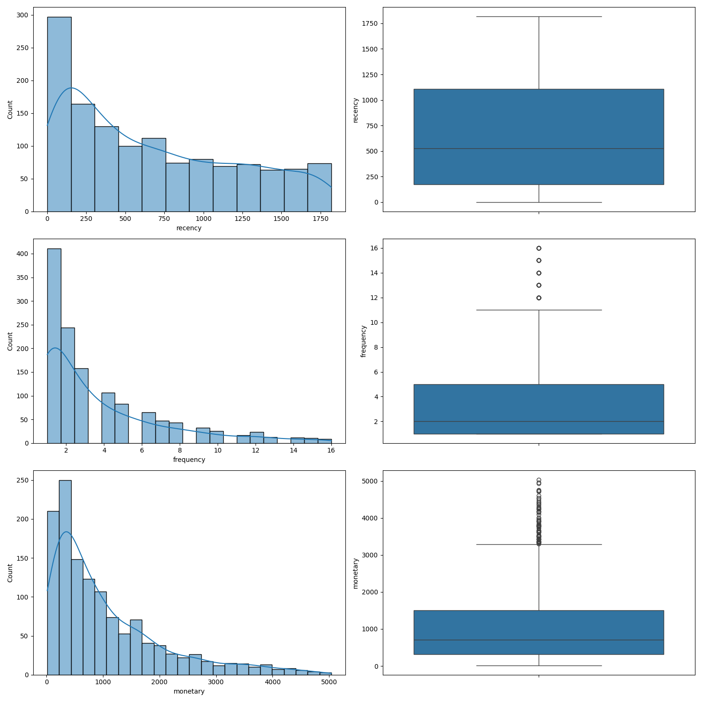

# MLTRL Card - RFM-Analysis - level 4

| Summary info        | Content, links       |
| -------------------------- | ------------- |
| Tech name               | RFM-Analysis - Car Repair Shop   |
| Current Level           | 4 [(See level 3)](./mltrl_card_level_3.md) |
| Owner(s)                | Christian Wissor                        |
| Reviewer(s)             | Christian Wissor                           |
| Main project page       | *none*   |
| Req's, V&V docs         | Master-Thesis   |
| Code repo & docs        | [Github Repository](https://github.com/SmithyW/master-thesis-mlops-study-imlpementation)   |
| Ethics checks?          | *none* |
| Coupled components      | *none*         |

**TL;DR** — The RFM-Analysis is clustering project for segmenting customer of a small car repair shop. 

### Top-level requirements

*the underlying master-thesis serves as the full requirements documentation and is not publicly available*

1. The model be capable of segmenting customers in a comporehensible way.
2. Integration into third-party systems for inference should be made possible via a suitable interface.

### Model info

The model is a K-Nearest Neighbor (KNN) estimator. For the input labels a K-Means clustering algorithm is used initially. The Model is created using a sklearn Pipeline including the data scaler and the KNN model. 

Implementation notes:

- Implementation leverages the python library scikit-learn. 
- Implementation is dependent on mlflow for experiment tracking and model registry.

#### Confusion Matrix for the KNN

### Intended use

- The model will assign a segment to a customer based on features for a conventional RFM-Analysis.
- The allocation is intended to be accomplished with exported model performing inference in a separate application.
- The RFM features will be used as input data, so the creation of that features has to be accomplished beforehand.

### Testing status

*no tests are specified or planned for now*

**Extra notes**: The model can be seen as uncritical when considering safety aspects and the entrpreneurial risk.

### Data considerations

A production invoice dataset is available for experimenting and model training.

Raw data conversion to parquet as intermediate file.
The data requires extensive preprocessing due to typos and missing validation in the source system.

The raw data is processed to protect customer privacy.

Computed values: Monetary values are highly right-skewed, Recency lightly right-skewed and Frequency is in a narrow range of values with missing values.

Frequency values of 1 are omitted for skipping non-meaningful first-time or past one-time customers.

Few extreme outliers are present in the input data.

The data allows for scaling using sklearns StandardScaler.

#### Initial data distribution

#### Distribution after removal of ouliers

### Caveats, known edge cases, recommendations

- Specifying the amount of segments is still needed beforehand.
- Applying of privacy to the customer data requires fuzzy matching of customer names, which is not ideal and costly in terms of computational ressources.
- Recommended to update the data source to deliver unique customer IDs for all corresponding vehicles.

### MLTRL stage debrief

<!-- Succinct summary of stage progress – please respond to each question, link to extended material if needed... -->

1. What was accomplished, and by who?

    - Due to using real-world data since the beginning, only the inference implementation using imported models from the registry was implemented as PoC.

2. What was punted and/or de-scoped?

    - n/a

3. What was learned?

    - Using Tooling from the beginning seems to reduce the effort of qualifying for the next MLTRL

4. What tech debt was gained? Mitigated?

    - n/a

---
